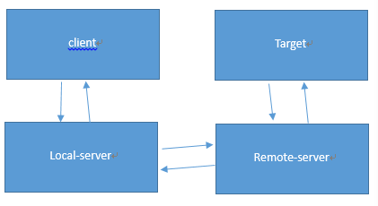
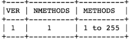
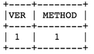
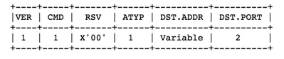
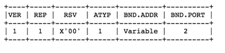

# shadowsocks-go项目

## 主流程

- ### 架构图



- ### local-server

  - 配置

    ```go
    type Config struct {
    	Server       interface{} `json:"server"`
    	ServerPort   int         `json:"server_port"`
    	LocalPort    int         `json:"local_port"`
    	LocalAddress string      `json:"local_address"`
    	Password     string      `json:"password"`
    	Method       string      `json:"method"` // encryption method
    
    	// following options are only used by server
    	PortPassword map[string]string `json:"port_password"`
    	Timeout      int               `json:"timeout"`
    
    	// following options are only used by client
    
    	// The order of servers in the client config is significant, so use array
    	// instead of map to preserve the order.
    	ServerPassword [][]string `json:"server_password"`
    }
    ```

    - Server : 指定remote server的地址，可以指定单个server,也可以指定多个server(一般不用)，具体可以参考	func (config *Config) GetServerArray() []string  函数

    - ServerPort:  remote server的默认端口，如果Server中的地址没有带端口，则使用ServerPort,否则使用Server中地址自带的端口

    - LocalPort : local-server监听端口

    - LocalAddress ：local-server监听地址

    - Password : Server指定的remote server的访问密码

    - Method : Server指定的remote server的加解密方法名

    - ServerPassword: 用于指定多个remote server


  - 主逻辑

    - local-server 监听LocalAddress和LocalPort指定的地址和端口

    - client发起和local-server的连接，先进行socks5协议的协商和认证，具体可参看“socks5协议交互”一节，local-server获取到client的target地址rawaddr

    - local-server向remote-server发起连接,将rawaddr发送给remote-server

    - 开启一个Goroutine,专门负责从client接受数据，再发送给remote-server,主Goroutine负责从remote-server接受数据，再发送给client


  - 加密解密

    - shadowsocks.Conn

      ```go
      type Conn struct {
      	net.Conn
      	*Cipher
      	readBuf  []byte
      	writeBuf []byte
      }
      ```

    - func (c *Conn) Write(b []byte) (n int, err error) 往remote-server发数据时，先对数据进行加密

    - func (c *Conn) Read(b []byte) (n int, err error)  从remote-server读数据时，将读到的数据先解密再返回


- ### remote-server

  - 配置

    - PortPassword：remote-server要监听的端口以及对应的密码
    - Method：remote server的加解密方法名

  - 主逻辑

    - TODO


  - 远程管理managerDaemon
    - 增删监听端口
    - 增删报告接收对象
    - 向报告接收对象发送统计数值

## 关键点

- ### socks5协议交互


1. client与local-server建立tcp连接后，client发送request来协商版本和认证方式

   

   - ver：0x05

   - nmethods: 客户端支持的方法总数

   - methods:客户端支持的方法，每个方法标志占一个字节

2. local-server给client的返回

   

   - ver: 0x05
   - method: 0x00 表示没有启用认证

3. client发送connect request给local-server

   

   - ver : 0x05
   - cmd:0x01 -->sock CONNECT命令
   - ATYP：地址类型
     1. IPV4地址: X’01’
     2. 域名地址: X’03’ ，该情况下，DST.ADDR中有一个addrlen字段占一个字节，表示域名地址的长度
     3. IPV6地址: X’04’

4. local-server给client的返回

   

   - ver：0x05

   - rep: 0x00-->成功

   - atyp:0x01--> IPV4 address

   - BND.ADDR: 服务器绑定的地址，0X00 0X00 0X00 0X00

   - BND.PORT: 服务器绑定的端口；


- ### leakybuf 内存池实现

  ```go
  type LeakyBuf struct {
  	bufSize  int // size of each buffer
  	freeList chan []byte
  }
  
  const leakyBufSize = 4108 // data.len(2) + hmacsha1(10) + data(4096)
  const maxNBuf = 2048
  
  var leakyBuf = NewLeakyBuf(maxNBuf, leakyBufSize)
  ```

  1. 属性
     - buffer : []byte,大小由bufSize指定
     - bufSize :每个buffer的大小
     - freeList: 用于缓存buffer

  2. 方法

     - get方法： 获取buffer,当缓存中没有可用buffer时，创建新的buffer

     ```go
     func (lb *LeakyBuf) Get() (b []byte) {
     	select {
     	case b = <-lb.freeList:
     	default:
     		b = make([]byte, lb.bufSize)
     	}
     	return
     }
     ```

     - put方法：将buffer放到缓存中,当缓存中满时，不做处理，让其内存自动回收

       ```go
       func (lb *LeakyBuf) Put(b []byte) {
       	if len(b) != lb.bufSize {
       		panic("invalid buffer size that's put into leaky buffer")
       	}
       	select {
       	case lb.freeList <- b:
       	default:
       	}
       	return
       }
       ```


- ### 连接EOF处理

  读出现EOF错误时，可能会读到一些数据，这些数据需要先处理

  ```go
  	for {
  		SetReadTimeout(src)
  		n, err := src.Read(buf)
  		if addTraffic != nil {
  			addTraffic(n)
  		}
  		// read may return EOF with n > 0
  		// should always process n > 0 bytes before handling error
  		if n > 0 {
  			// Note: avoid overwrite err returned by Read.
  			if _, err := dst.Write(buf[0:n]); err != nil {
  				Debug.Println("write:", err)
  				break
  			}
  		}
  		if err != nil {
  			// Always "use of closed network connection", but no easy way to
  			// identify this specific error. So just leave the error along for now.
  			// More info here: https://code.google.com/p/go/issues/detail?id=4373
  			/*
  				if bool(Debug) && err != io.EOF {
  					Debug.Println("read:", err)
  				}
  			*/
  			break
  		}
  	}
  ```
